# Analiza Flow-urilor Servicii eGhiseul

## Executive Summary

După analizarea celor 12 servicii existente din WPForms, am identificat **pattern-uri comune**, **inconsistențe** și **oportunități de standardizare** pentru noua platformă.

### Concluzii Principale

1. **3 categorii distincte de servicii** cu flow-uri diferite
2. **Inconsistențe în ordinea pașilor** între servicii similare
3. **KYC duplicat** - aceleași câmpuri cerute în moduri diferite
4. **Cross-sell neuniform** - unele servicii au, altele nu
5. **Prețuri traduceri identice** dar prezentate diferit

---

## Partea 1: Categorizarea Serviciilor

### Categoria A: Caziere & Fișe (KYC Obligatoriu)

| Serviciu | Preț Bază | Urgență | Traduceri | Cross-sell |
|----------|-----------|---------|-----------|------------|
| Cazier Judiciar | 250 RON | Da (+100) | 9 limbi | CIC (+150) |
| Cazier Fiscal | 250 RON | Da (+100) | 8 limbi | Nu |
| Cazier Auto | 199-249 RON | Da | 9 limbi | Nu |
| Cert. Integritate | 250 RON | Da (+100) | 9 limbi | Cazier (+150) |

**Observații:**
- Prețuri similare (199-250 RON)
- Toate au opțiune urgență
- Cazier Judiciar și CIC au cross-sell bidirecțional
- Cazier Fiscal și Auto nu au cross-sell (oportunitate!)

### Categoria B: Certificate Stare Civilă (KYC + Complexitate Mare)

| Serviciu | Preț Bază | Traduceri | Cross-sell |
|----------|-----------|-----------|------------|
| Cert. Naștere | 1.190 RON | 20 limbi (5 tiers) | Multilingv (+399) |
| Cert. Căsătorie | 1.190 RON | 20 limbi (5 tiers) | Multilingv (+399) |
| Cert. Celibat | 699 RON | 20 limbi (5 tiers) | Cert. Naștere (+999) |
| Multilingv Naștere | 799 RON | N/A | Duplicat (+790) |
| Multilingv Căsătorie | 799 RON | N/A | Duplicat (+790) |

**Observații:**
- Prețuri mai mari (699-1.190 RON)
- Sistem traduceri complex cu 5 tiers de preț
- Cross-sell strategic între certificate
- Multilingv = nu necesită traducere (avantaj de promovat!)

### Categoria C: Documente Business (Fără KYC)

| Serviciu | Preț Bază | KYC | Complexitate |
|----------|-----------|-----|--------------|
| Extras Carte Funciară | 79.99-249.99 RON | NU | Medie |
| Certificat Constatator | 119.99-499.99 RON | NU | Mică |
| Rovinieta | Variabil | NU | Foarte mică |

**Observații:**
- Nu necesită KYC (verificare identitate)
- Procesare mai rapidă
- Cert. Constatator cel mai simplu

---

## Partea 2: Comparație Flow-uri Actuale

### Flow Cazier Judiciar vs Cazier Fiscal

```mermaid
flowchart TB
    subgraph CJ["CAZIER JUDICIAR - 7 pasi"]
        CJ1[1. Date Contact] --> CJ2[2. Date Personale + Motiv]
        CJ2 --> CJ3[3. Optiuni Serviciu]
        CJ3 --> CJ4[4. KYC Documente]
        CJ4 --> CJ5[5. Semnatura Contract]
        CJ5 --> CJ6[6. Livrare]
        CJ6 --> CJ7[7. Facturare + Plata]
    end

    subgraph CF["CAZIER FISCAL - 6 pasi"]
        CF1[1. Date Contact] --> CF2[2. Date Personale]
        CF2 --> CF3[3. Serviciu + Motiv]
        CF3 --> CF4[4. Livrare]
        CF4 --> CF5[5. KYC + Semnatura]
        CF5 --> CF6[6. Facturare + Plata]
    end
```

**Diferențe identificate:**
| Aspect | Cazier Judiciar | Cazier Fiscal |
|--------|-----------------|---------------|
| Nr. pași | 7 | 6 |
| Ordinea KYC | Pas 4 | Pas 5 |
| Ordinea Livrare | Pas 6 | Pas 4 |
| Cross-sell | Da (CIC) | Nu |
| Motiv solicitare | 28 opțiuni | 28 opțiuni |
| Cetățenie | Da (RO/străin) | Nu |

### Flow Certificate Stare Civilă

```mermaid
flowchart TB
    subgraph CN["CERTIFICAT NASTERE - 7 pasi"]
        CN1[1. Contact] --> CN2[2. Date Personale + Minor/Adult]
        CN2 --> CN3[3. Serviciu + Destinatie]
        CN3 --> CN4[4. KYC Documente]
        CN4 --> CN5[5. Semnatura]
        CN5 --> CN6[6. Optiuni + Livrare]
        CN6 --> CN7[7. Facturare + Plata]
    end

    subgraph CC["CERTIFICAT CASATORIE - 7 pasi"]
        CC1[1. Contact] --> CC2[2. Serviciu + Date Casatorie]
        CC2 --> CC3[3. Livrare]
        CC3 --> CC4[4. KYC Documente]
        CC4 --> CC5[5. Semnatura]
        CC5 --> CC6[6. Facturare]
        CC6 --> CC7[7. Plata]
    end
```

**Problema:** Opțiunile și Livrarea sunt în pași diferiți!

---

## Partea 3: Inconsistențe Identificate

### 1. Ordinea Pașilor Variază

| Serviciu | Contact | Date | Serviciu | KYC | Semnătură | Livrare | Plată |
|----------|---------|------|----------|-----|-----------|---------|-------|
| Cazier Judiciar | 1 | 2 | 3 | 4 | 5 | 6 | 7 |
| Cazier Fiscal | 1 | 2 | 3 | 5 | 5 | 4 | 6 |
| Cert. Naștere | 1 | 2 | 3 | 4 | 5 | 6 | 7 |
| Cert. Căsătorie | 1 | 2 | 3 | 4 | 5 | 3 | 7 |
| Cazier Auto | 1 | 1 | 2 | 3 | 4 | 2 | 6 |

**Problema:** Utilizatorul nu are o experiență consistentă între servicii.

### 2. Câmpuri KYC Diferite

| Câmp | CJ | CF | CA | CIC | CN | CC |
|------|----|----|----|----|----|----|
| Upload CI | ✓ | ✓ | ✓ | ✓ | ✓ | ✓ |
| Selfie cu CI | ✓ | ✓ | ✓ | ✓ | ✓ | ✓ |
| Semnătură | ✓ | ✓ | ✓ | ✓ | ✓ | ✓ |
| Upload Pașaport | ✓ | ✗ | ✗ | ✗ | ✓ | ✓ |
| Upload Permis | ✗ | ✗ | ✓ | ✗ | ✗ | ✗ |
| Acte Părinți | ✗ | ✗ | ✗ | ✗ | ✓* | ✗ |

*doar pentru minori

### 3. Traduceri - Prețuri Inconsistente

| Limbă | Caziere | Stare Civilă |
|-------|---------|--------------|
| Engleză | 178.50 | 178.50 |
| Franceză | 178.50 | 178.50 |
| Germană | 178.50 | 178.50 |
| Rusă | - | 238.00/297.50 |
| Arabă | 178.50 | - |

**Problema:** Lista de limbi diferă între servicii.

### 4. Cross-sell Neuniform

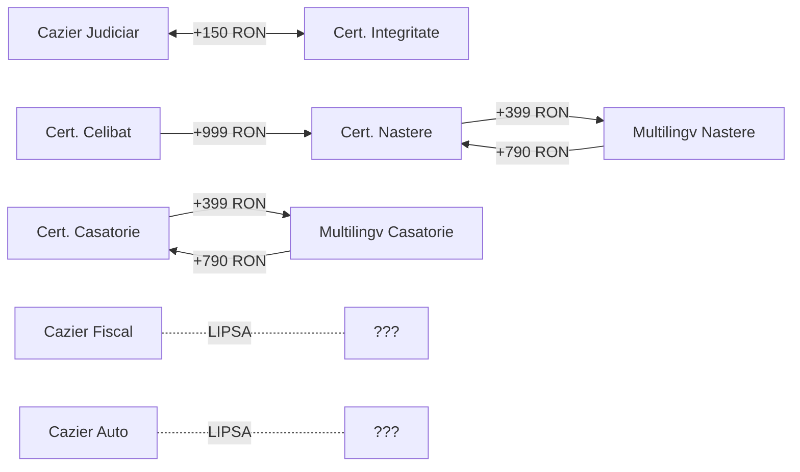

**Oportunități:**
- Cazier Fiscal + Cazier Judiciar bundle?
- Cazier Auto + Cazier Judiciar pentru șoferi profesioniști?

---

## Partea 4: Flow Standardizat Propus

### Principii de Design

1. **Consistență** - Aceeași ordine a pașilor pentru servicii similare
2. **Progressive Disclosure** - Informații complexe doar când sunt relevante
3. **Cross-sell Strategic** - Oferte relevante la momentul potrivit
4. **Mobile-First** - Optimizat pentru completare pe telefon

### Flow Universal Propus (6 pași)

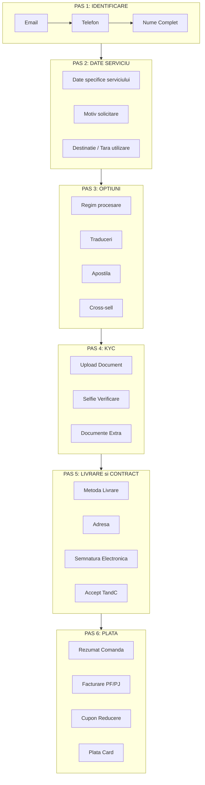

### Flow Detaliat per Categorie

#### A. Flow Caziere (Standardizat)

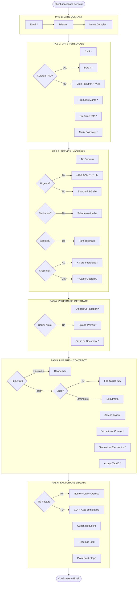

#### B. Flow Certificate Stare Civilă (Standardizat)

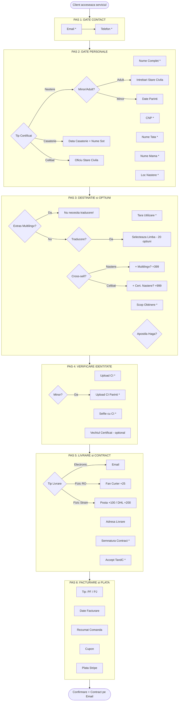

---

## Partea 5: Journey Complet A-Z

### Customer Journey Map

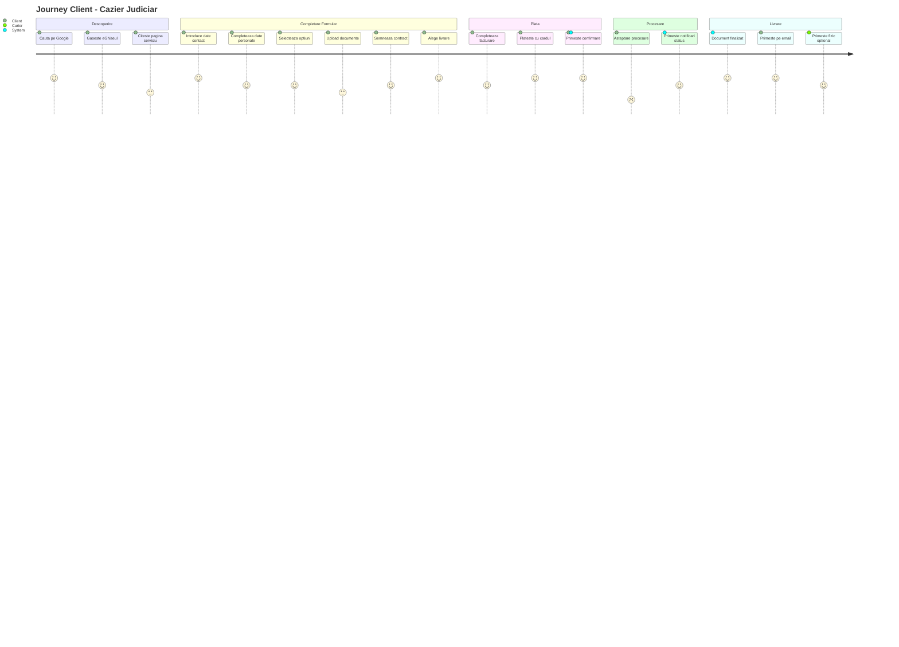

### Sequence Diagram - Flow Tehnic

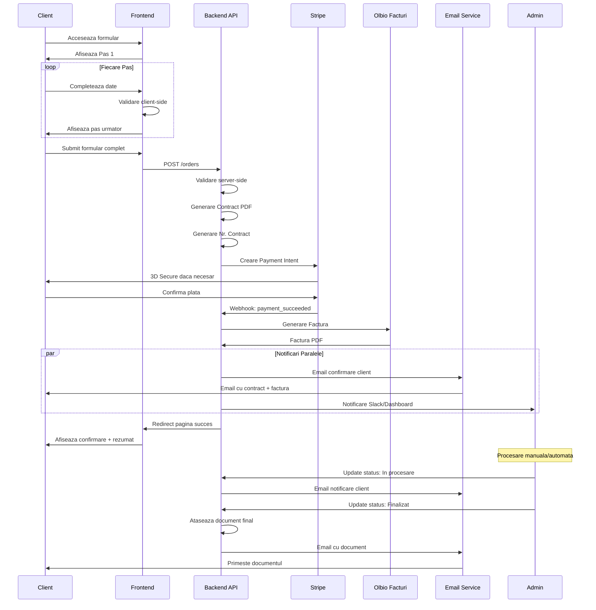

### State Machine - Status Comanda

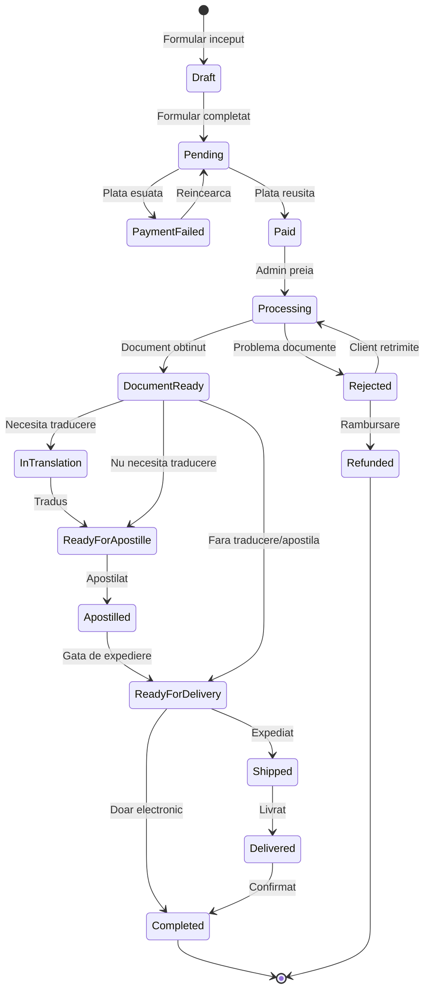

---

## Partea 6: Recomandări pentru Noua Platformă

### 1. Standardizare Flow-uri

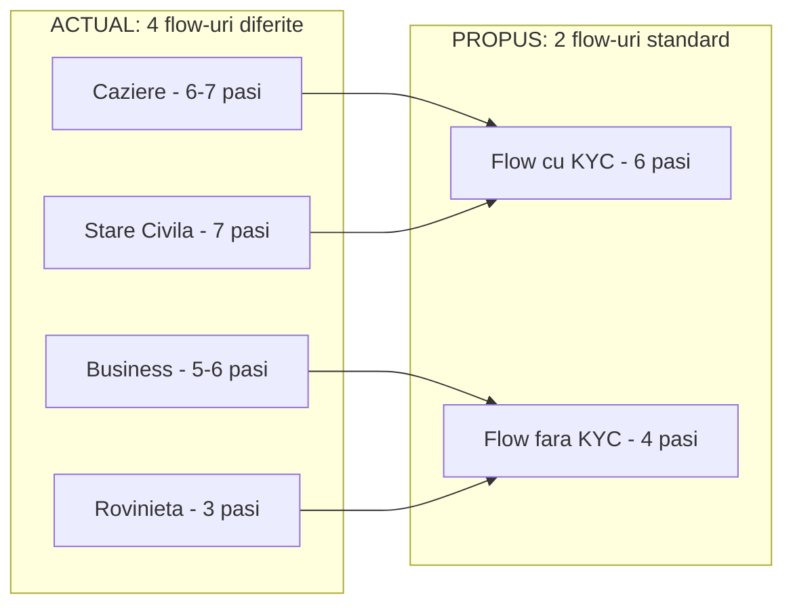

### 2. Componente Reutilizabile

| Componentă | Servicii care o folosesc |
|------------|-------------------------|
| `<ContactStep>` | Toate |
| `<KYCUploader>` | Caziere, Stare Civilă |
| `<SignatureCanvas>` | Caziere, Stare Civilă |
| `<TranslationSelector>` | Toate cu traduceri |
| `<DeliveryOptions>` | Toate |
| `<BillingForm>` | Toate |
| `<StripePayment>` | Toate |
| `<CrossSellBanner>` | Selectate |

### 3. Îmbunătățiri UX Propuse

#### A. Progress Indicator Unificat
```
┌─────────────────────────────────────────────────────────┐
│  ○ Contact  ●━━━○ Date  ○━━━○ Opțiuni  ○━━━○ KYC  ○━━━○ Plată │
│                  ↑                                      │
│             Ești aici                                   │
└─────────────────────────────────────────────────────────┘
```

#### B. Smart Cross-sell (contextual)
```
┌─────────────────────────────────────────────────────────┐
│  💡 Știai că 73% din clienții care comandă Cazier       │
│     Judiciar au nevoie și de Certificat Integritate?    │
│                                                         │
│     [+ Adaugă la comandă: doar 150 RON] [Nu, mulțumesc] │
└─────────────────────────────────────────────────────────┘
```

#### C. Salvare Automată Draft
```
┌─────────────────────────────────────────────────────────┐
│  ✓ Progresul tău a fost salvat automat                  │
│    Poți continua oricând de pe acest dispozitiv        │
│    sau [Trimite link pe email]                          │
└─────────────────────────────────────────────────────────┘
```

#### D. AI Pre-fill din CI
```
┌─────────────────────────────────────────────────────────┐
│  📷 Am detectat datele din documentul încărcat:         │
│                                                         │
│  Nume: POPESCU ION                    [✓ Corect]       │
│  CNP: 1850315123456                   [✓ Corect]       │
│  Adresă: Str. Victoriei 10, București [✎ Editează]    │
│                                                         │
│  [Confirmă și continuă]                                 │
└─────────────────────────────────────────────────────────┘
```

### 4. Arhitectură Tehnică Propusă

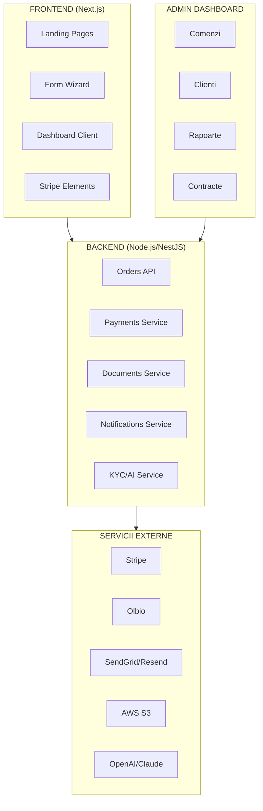

---

## Partea 7: Acțiuni Recomandate

### Prioritate 1: Quick Wins
- [ ] Standardizare ordine pași (Contact → Date → Opțiuni → KYC → Livrare → Plată)
- [ ] Unificare liste limbi traducere
- [ ] Adăugare cross-sell la Cazier Fiscal și Cazier Auto

### Prioritate 2: Îmbunătățiri Medium
- [ ] Componente reutilizabile pentru fiecare pas
- [ ] Salvare automată draft
- [ ] Progress indicator vizual consistent

### Prioritate 3: Features Avansate
- [ ] AI OCR pentru extragere date din CI
- [ ] Smart cross-sell bazat pe comportament
- [ ] Dashboard client pentru tracking comenzi

---

## Anexă: Mapping Câmpuri

### Câmpuri Comune (toate serviciile cu KYC)

| Câmp | Tip | Validare |
|------|-----|----------|
| email | string | Email valid |
| telefon | string | Format RO/internațional |
| nume_complet | string | Min 3 caractere |
| cnp | string | 13 cifre, validare algoritm |
| tip_factura | enum | PF / PJ |
| cui | string | Validare ANAF API |
| tip_livrare | enum | electronic / fizic |
| adresa_livrare | object | Dacă fizic |
| semnatura | base64 | Canvas signature |
| accept_tc | boolean | Obligatoriu true |

### Câmpuri Specifice per Serviciu

| Serviciu | Câmpuri Unice |
|----------|---------------|
| Cazier Judiciar | cetatenie, tara_nastere, viza_resedinta |
| Cazier Fiscal | - (cel mai simplu) |
| Cazier Auto | numar_permis, tip_permis |
| Cert. Naștere | loc_nastere, minor_adult, acte_parinti |
| Cert. Căsătorie | data_casatorie, nume_sot_inainte |
| Cert. Celibat | oficiu_stare_civila, casatorit_anterior |
| Cert. Integritate | - (similar Cazier) |

---

*Document generat: 15 Decembrie 2024*
*Versiune: 1.0*
