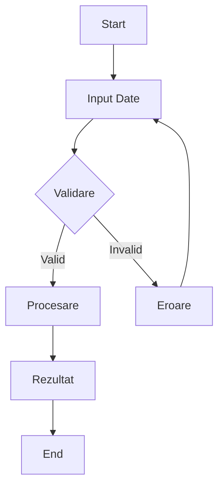

# [Nume Serviciu]

> Template pentru documentarea serviciilor eghiseul.ro

## Overview

| Atribut | Valoare |
|---------|---------|
| **ID Serviciu** | SRV-XXX |
| **Categorie** | [Documente / Plăți / Asigurări / Înmatriculări / etc.] |
| **Status** | [Planificat / În dezvoltare / Activ] |
| **Prioritate** | [P0 / P1 / P2 / P3] |
| **API Disponibil** | [Da / Nu / Planificat] |

## Descriere

[Descriere scurtă a serviciului - ce face, pentru cine e, de ce e util]

## User Flow

### Flow Principal (Happy Path)

```
1. [Utilizatorul accesează serviciul]
   ↓
2. [Completează datele necesare]
   ↓
3. [Validare date]
   ↓
4. [Procesare / Plată dacă e cazul]
   ↓
5. [Confirmare și rezultat]
```

### Flow Diagram



## Date Necesare (Input)

| Câmp | Tip | Obligatoriu | Validare | Exemplu |
|------|-----|-------------|----------|---------|
| CNP | string | Da | 13 cifre, validare checksum | 1900101123456 |
| ... | ... | ... | ... | ... |

## Rezultat (Output)

| Câmp | Tip | Descriere |
|------|-----|-----------|
| status | string | success / error |
| ... | ... | ... |

## Integrări Externe

| Sistem | Tip | Descriere |
|--------|-----|-----------|
| [Nume sistem extern] | API / Scraping / Manual | [Ce date primim/trimitem] |

## Reguli de Business

1. [Regulă 1 - ex: Serviciul e disponibil doar pentru persoane fizice]
2. [Regulă 2 - ex: Plata trebuie efectuată în maxim 24h]
3. ...

## Prețuri și Taxe

| Element | Valoare | Descriere |
|---------|---------|-----------|
| Preț serviciu | X RON | Comisionul eghiseul.ro |
| Taxă externă | Y RON | Taxa percepută de instituție |
| Total utilizator | Z RON | Ce plătește clientul |

## Cazuri Speciale / Edge Cases

1. **[Caz 1]**: [Descriere și cum se tratează]
2. **[Caz 2]**: [Descriere și cum se tratează]

## Erori Posibile

| Cod Eroare | Mesaj | Cauză | Soluție |
|------------|-------|-------|---------|
| ERR_001 | [Mesaj] | [De ce apare] | [Cum se rezolvă] |

## Notificări

| Eveniment | Canal | Template |
|-----------|-------|----------|
| Comandă plasată | Email, SMS | "Comanda #X a fost înregistrată..." |
| Procesare finalizată | Email, Push | "Documentul este disponibil..." |

## SLA și Termene

| Metric | Target |
|--------|--------|
| Timp procesare | [ex: 24-48h] |
| Disponibilitate | [ex: 99.9%] |
| Timp răspuns API | [ex: < 2s] |

## Note pentru Dezvoltare

- [Note tehnice importante]
- [Dependențe]
- [Considerații de securitate]

## Istoric Modificări

| Data | Versiune | Modificare |
|------|----------|------------|
| YYYY-MM-DD | 1.0 | Document inițial |
