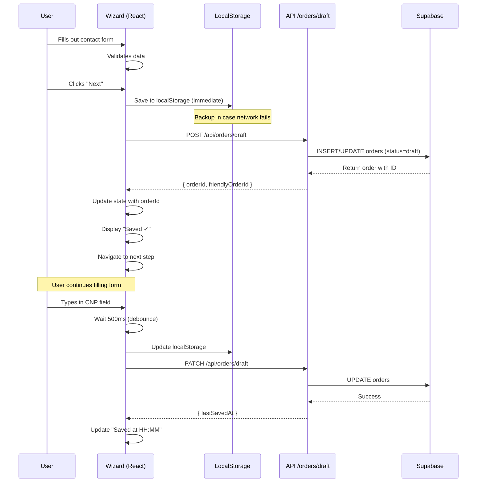
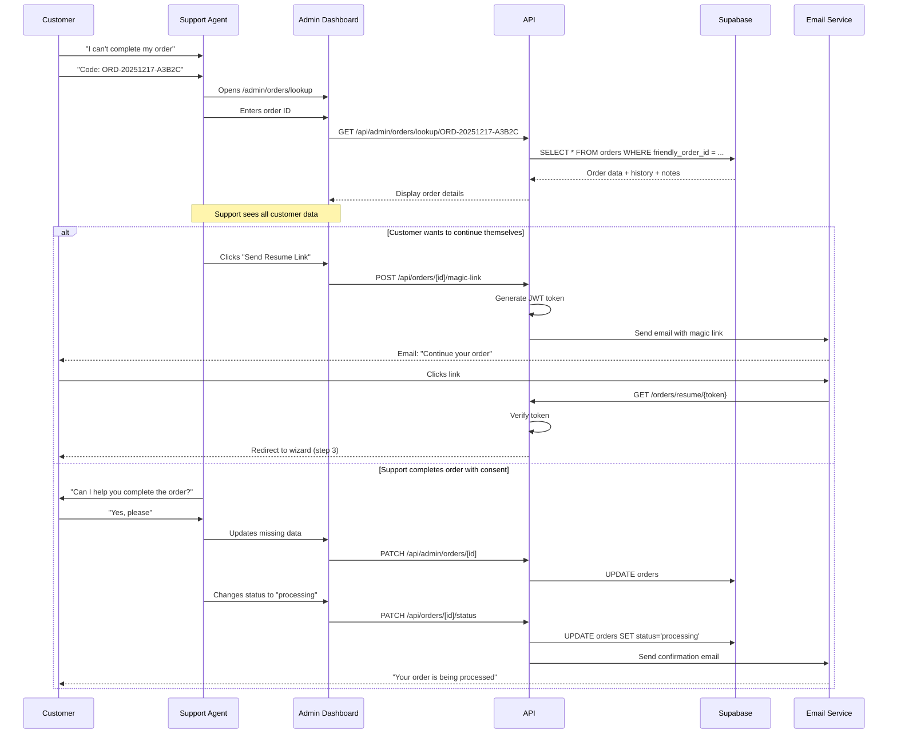
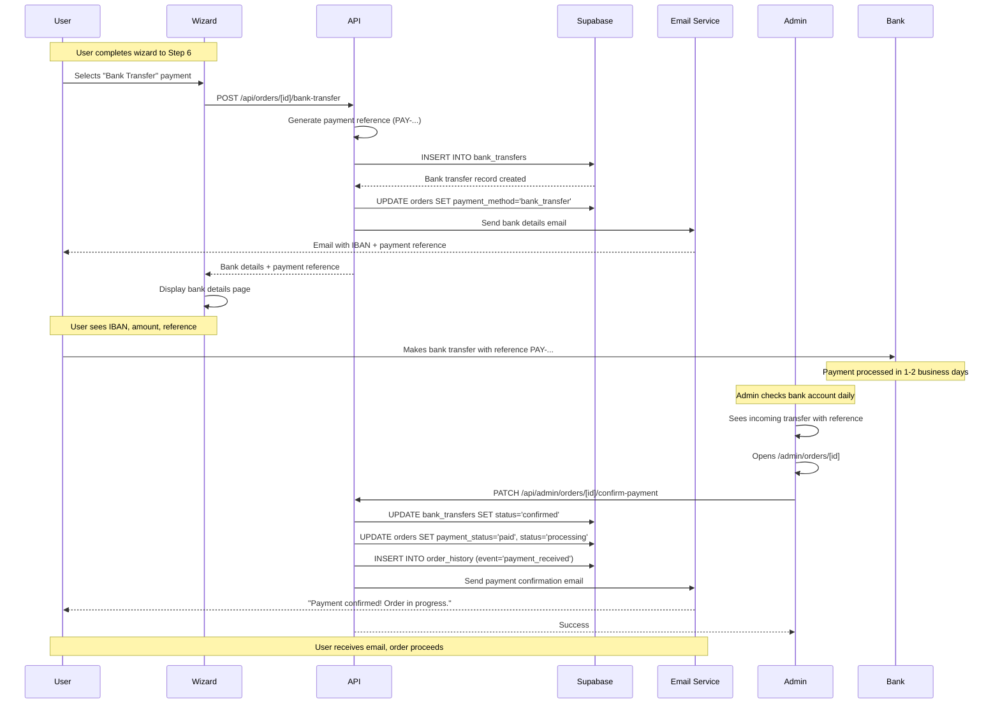

# Order Auto-Save & Support System

**Version:** 1.1
**Status:** Partially Implemented
**Created:** 2025-12-17
**Updated:** 2025-12-18
**Sprint:** Sprint 3 - Order Management Enhancement

## Implementation Status

| Feature | Status | Notes |
|---------|--------|-------|
| Order ID Generation | ✅ Complete | `lib/order-id.ts` |
| Friendly Order ID DB Column | ✅ Complete | `migrations/008_friendly_order_id.sql` |
| Draft API Endpoint | ✅ Complete | `api/orders/draft/route.ts` |
| Auto-Save (Debounced) | ✅ Complete | 500ms debounce in provider |
| localStorage Backup | ✅ Complete | Offline resilience |
| Save Status UI | ✅ Complete | `components/orders/save-status.tsx` |
| Order ID Display | ✅ Complete | `components/orders/order-id-display.tsx` |
| Bank Transfer Flow | ⏳ Pending | Phase 2 |
| Magic Links Recovery | ⏳ Pending | Phase 2 |
| Support Dashboard | ⏳ Pending | Phase 2 |
| Abandoned Order Emails | ⏳ Pending | Phase 2 |

---

## Table of Contents

1. [Overview](#overview)
2. [System Goals](#system-goals)
3. [Order ID Generation](#order-id-generation)
4. [Auto-Save Mechanism](#auto-save-mechanism)
5. [Support Access System](#support-access-system)
6. [Bank Transfer Flow](#bank-transfer-flow)
7. [Order Recovery System](#order-recovery-system)
8. [Database Schema](#database-schema)
9. [API Endpoints](#api-endpoints)
10. [Sequence Diagrams](#sequence-diagrams)
11. [Security Considerations](#security-considerations)
12. [Performance & Scalability](#performance--scalability)
13. [Implementation Checklist](#implementation-checklist)

---

## Overview

The Order Auto-Save & Support System provides resilience, recovery, and support capabilities for the 6-step order wizard. It addresses three critical user scenarios:

1. **Order Abandonment**: Users can return to incomplete orders without data loss
2. **Payment Issues**: Alternative payment methods (bank transfer) for failed card payments
3. **Support Assistance**: Support team can help customers complete their orders

### Key Features

- Unique order IDs generated at wizard start
- Real-time auto-save with offline backup
- Support team lookup and order continuation
- Bank transfer as alternative payment method
- Order recovery via email magic links
- Complete audit trail

---

## System Goals

### User Experience Goals

- **Zero Data Loss**: Save progress automatically, never lose customer data
- **Transparent Progress**: Always show order ID and save status to users
- **Easy Recovery**: Simple links to resume orders from any device
- **Flexible Payment**: Support both card and bank transfer payments

### Business Goals

- **Reduce Abandonment**: Recover 30% of abandoned orders via email recovery
- **Support Efficiency**: Enable support team to help customers quickly
- **Payment Options**: Increase conversion by offering bank transfer
- **Audit Trail**: Complete history for compliance and dispute resolution

### Technical Goals

- **Resilience**: Offline-first with local storage backup
- **Performance**: Debounced saves, no UI blocking
- **Security**: Row-level security, audit logging
- **Scalability**: Handle 1000+ draft orders concurrently

---

## Order ID Generation

### Format Specification

**Format**: `ORD-YYYYMMDD-XXXXX`

**Components**:
- `ORD`: Fixed prefix for order identification
- `YYYYMMDD`: Date of order creation (e.g., 20251217)
- `XXXXX`: 5-character alphanumeric code (Base32, excluding ambiguous chars)

**Examples**:
```
ORD-20251217-A3B2C
ORD-20251217-F8K9M
ORD-20251218-Q2R7T
```

### Generation Algorithm

**Character Set**: `ABCDEFGHJKLMNPQRSTUVWXYZ23456789` (32 chars, excludes: I, O, 0, 1)

**Collision Prevention**:
- 32^5 = 33,554,432 possible codes per day
- Low collision probability (<0.001% for 1000 orders/day)
- Database unique constraint ensures no duplicates

**Implementation**:

```typescript
// src/lib/order-id-generator.ts

const BASE32_CHARS = 'ABCDEFGHJKLMNPQRSTUVWXYZ23456789';

export function generateOrderId(): string {
  const date = new Date()
    .toISOString()
    .slice(0, 10)
    .replace(/-/g, ''); // YYYYMMDD

  // Generate 5 random Base32 characters
  let code = '';
  for (let i = 0; i < 5; i++) {
    const randomIndex = Math.floor(Math.random() * BASE32_CHARS.length);
    code += BASE32_CHARS[randomIndex];
  }

  return `ORD-${date}-${code}`;
}

export function validateOrderId(orderId: string): boolean {
  const pattern = /^ORD-\d{8}-[ABCDEFGHJKLMNPQRSTUVWXYZ23456789]{5}$/;
  return pattern.test(orderId);
}
```

### Display to User

**Wizard Header** (always visible):
```
┌─────────────────────────────────────────┐
│  Cod comandă: ORD-20251217-A3B2C       │
│  ✓ Salvat automat                       │
└─────────────────────────────────────────┘
```

**Support Message**:
```
💬 Ai nevoie de ajutor?
Contactează-ne și menționează codul comenzii tale:
ORD-20251217-A3B2C
```

---

## Auto-Save Mechanism

### Save Triggers

**1. Step Completion** (immediate save):
- User clicks "Next" to move to next step
- Validate step data, then save
- Show success indicator

**2. Field Changes** (debounced save):
- Save 500ms after user stops typing
- Only for text inputs (CNP, name, address)
- Prevents excessive database writes

**3. Option Selection** (immediate save):
- User selects/deselects service options
- Update price calculation, then save

**4. Periodic Backup** (every 30 seconds):
- Fallback for inactive users
- Only if `isDirty` flag is true

### Save Strategy

**Primary Storage**: PostgreSQL `orders` table (status = 'draft')
**Backup Storage**: Browser localStorage (offline resilience)

**Local Storage Schema**:
```typescript
// localStorage key: `order_draft_${orderId}`
interface DraftOrderCache {
  orderId: string;
  serviceSlug: string;
  currentStep: WizardStep;
  stepNumber: number;
  data: {
    contact?: Partial<ContactData>;
    personal?: Partial<PersonalData>;
    options?: SelectedOption[];
    kyc?: Partial<KYCDocuments>;
    delivery?: Partial<DeliverySelection>;
  };
  lastSavedAt: string; // ISO timestamp
  version: number; // schema version for migrations
}
```

### Auto-Save Flow

```typescript
// src/providers/order-wizard-provider.tsx

const saveDraft = useCallback(async () => {
  if (!state.service || !state.orderId) return;

  dispatch({ type: 'SAVE_START' });

  try {
    // 1. Save to localStorage (immediate, no network)
    const cacheKey = `order_draft_${state.orderId}`;
    localStorage.setItem(cacheKey, JSON.stringify({
      orderId: state.orderId,
      serviceSlug: state.serviceSlug,
      currentStep: state.currentStep,
      stepNumber: state.stepNumber,
      data: {
        contact: state.contactData,
        personal: state.personalData,
        options: state.selectedOptions,
        kyc: state.kycDocuments,
        delivery: state.deliverySelection,
      },
      lastSavedAt: new Date().toISOString(),
      version: 1,
    }));

    // 2. Save to database (network request)
    const response = await fetch('/api/orders/draft', {
      method: state.orderId ? 'PATCH' : 'POST',
      headers: { 'Content-Type': 'application/json' },
      body: JSON.stringify({
        id: state.orderId,
        service_id: state.service.id,
        status: 'draft',
        customer_data: {
          contact: state.contactData,
          personal: state.personalData,
        },
        selected_options: state.selectedOptions,
        kyc_documents: state.kycDocuments,
        delivery_method: state.deliverySelection.method,
        delivery_address: state.deliverySelection.address,
        ...priceBreakdown,
      }),
    });

    if (!response.ok) {
      throw new Error('Failed to save draft');
    }

    const data = await response.json();

    // 3. Update state with server response
    if (data.data?.order?.id && !state.orderId) {
      dispatch({ type: 'SET_ORDER_ID', payload: data.data.order.id });
    }

    dispatch({ type: 'SAVE_SUCCESS', payload: new Date().toISOString() });

  } catch (error) {
    // If network fails, localStorage backup ensures no data loss
    console.error('Auto-save failed:', error);

    dispatch({
      type: 'SAVE_ERROR',
      payload: error instanceof Error ? error.message : 'Save failed',
    });
  }
}, [state, priceBreakdown]);

// Debounced save on field changes
const debouncedSave = useMemo(
  () => debounce(saveDraft, 500),
  [saveDraft]
);

// Auto-save when data changes
useEffect(() => {
  if (state.isDirty && state.service) {
    debouncedSave();
  }
}, [state.isDirty, state.service, debouncedSave]);
```

### Save Status UI

**Status Indicator** (top right of wizard):
```tsx
// src/components/wizard/save-status.tsx

export function SaveStatus({
  isLoading,
  lastSavedAt,
  error
}: SaveStatusProps) {
  if (isLoading) {
    return (
      <div className="flex items-center text-gray-500">
        <Loader2 className="h-4 w-4 animate-spin mr-2" />
        <span>Se salvează...</span>
      </div>
    );
  }

  if (error) {
    return (
      <div className="flex items-center text-red-600">
        <AlertCircle className="h-4 w-4 mr-2" />
        <span>Eroare salvare</span>
        <Button variant="ghost" size="sm" onClick={retryManual}>
          Reîncearcă
        </Button>
      </div>
    );
  }

  if (lastSavedAt) {
    return (
      <div className="flex items-center text-green-600">
        <Check className="h-4 w-4 mr-2" />
        <span>Salvat {formatRelativeTime(lastSavedAt)}</span>
      </div>
    );
  }

  return null;
}
```

---

## Support Access System

### Use Cases

**1. Customer Calls Support**:
- Customer: "I can't complete my order, code ORD-20251217-A3B2C"
- Support looks up order, sees all data
- Support guides customer or completes order with consent

**2. Abandoned Order Recovery**:
- Support sees list of abandoned drafts >24h
- Calls customer to help complete order
- Converts draft to paid order

**3. Payment Issue Assistance**:
- Customer's card payment failed
- Support offers bank transfer option
- Support manually confirms payment when received

### Support Dashboard Features

**Order Lookup Page** (`/admin/orders/lookup`):

```tsx
// src/app/admin/orders/lookup/page.tsx

export default function OrderLookupPage() {
  const [orderId, setOrderId] = useState('');
  const [order, setOrder] = useState<Order | null>(null);

  async function lookupOrder() {
    const response = await fetch(`/api/admin/orders/${orderId}`);
    const data = await response.json();
    setOrder(data.order);
  }

  return (
    <div>
      <h1>Căutare Comandă</h1>

      <Input
        placeholder="ORD-20251217-A3B2C"
        value={orderId}
        onChange={(e) => setOrderId(e.target.value)}
      />
      <Button onClick={lookupOrder}>Caută</Button>

      {order && (
        <OrderDetailsCard order={order}>
          <OrderTimeline history={order.history} />
          <CustomerDataDisplay data={order.customer_data} />
          <KYCDocumentsView documents={order.kyc_documents} />
          <SupportActions order={order} />
        </OrderDetailsCard>
      )}
    </div>
  );
}
```

**Support Actions**:

```tsx
// src/components/admin/support-actions.tsx

export function SupportActions({ order }: { order: Order }) {
  const [note, setNote] = useState('');

  async function addNote() {
    await fetch(`/api/admin/orders/${order.id}/notes`, {
      method: 'POST',
      body: JSON.stringify({ note }),
    });
  }

  async function continueOrderOnBehalf() {
    // Generate magic link for customer
    const link = await generateMagicLink(order.id);

    // Copy link and send to customer via SMS/Email
    navigator.clipboard.writeText(link);
    toast.success('Link copiat. Trimite-l clientului.');
  }

  async function convertToBankTransfer() {
    // Switch order to bank transfer payment
    await fetch(`/api/admin/orders/${order.id}/bank-transfer`, {
      method: 'POST',
    });

    toast.success('Comanda convertită la plata prin transfer bancar.');
  }

  return (
    <Card>
      <CardHeader>Acțiuni Support</CardHeader>
      <CardContent>
        <div className="space-y-4">
          {/* Add Note */}
          <div>
            <Label>Adaugă Notă Internă</Label>
            <Textarea
              value={note}
              onChange={(e) => setNote(e.target.value)}
              placeholder="Notă pentru echipă..."
            />
            <Button onClick={addNote}>Salvează Notă</Button>
          </div>

          {/* Continue Order */}
          <Button onClick={continueOrderOnBehalf}>
            📧 Trimite Link de Continuare
          </Button>

          {/* Bank Transfer */}
          {order.payment_status === 'failed' && (
            <Button onClick={convertToBankTransfer}>
              🏦 Convertește la Transfer Bancar
            </Button>
          )}
        </div>
      </CardContent>
    </Card>
  );
}
```

### Order Notes System

**Admin Notes UI**:
- Visible only to support team
- Timestamped with admin name
- Searchable and filterable

**Example Note**:
```
[2025-12-17 14:30] - Ana Popescu (Support)
Customer called, card payment failed due to insufficient funds.
Offered bank transfer option. Customer agreed.
Generated payment reference: PAY-20251217-X7Y9Z
```

---

## Bank Transfer Flow

### Overview

Bank transfer is an alternative payment method for customers who:
- Have card payment failures
- Prefer traditional payment
- Don't have online banking cards

### Payment Flow

**1. Customer Selects Bank Transfer**:
```tsx
// Step 6: Review & Payment

<RadioGroup value={paymentMethod} onValueChange={setPaymentMethod}>
  <RadioGroupItem value="card" label="Plată cu Cardul" />
  <RadioGroupItem value="bank_transfer" label="Transfer Bancar" />
</RadioGroup>

{paymentMethod === 'bank_transfer' && (
  <BankTransferInstructions order={order} />
)}
```

**2. Generate Payment Reference**:

**Format**: `PAY-YYYYMMDD-XXXXX` (matches order ID format)

```typescript
export function generatePaymentReference(): string {
  const date = new Date()
    .toISOString()
    .slice(0, 10)
    .replace(/-/g, '');

  let code = '';
  for (let i = 0; i < 5; i++) {
    const randomIndex = Math.floor(Math.random() * BASE32_CHARS.length);
    code += BASE32_CHARS[randomIndex];
  }

  return `PAY-${date}-${code}`;
}
```

**3. Display Bank Details**:

```tsx
// src/components/orders/bank-transfer-instructions.tsx

export function BankTransferInstructions({ order }: { order: Order }) {
  const paymentRef = order.bank_transfer?.payment_reference;

  return (
    <Card className="border-blue-200 bg-blue-50">
      <CardHeader>
        <CardTitle>Detalii Transfer Bancar</CardTitle>
      </CardHeader>
      <CardContent>
        <div className="space-y-4">
          <div>
            <Label>Beneficiar</Label>
            <p className="font-mono">EGHIȘEUL ONLINE S.R.L.</p>
          </div>

          <div>
            <Label>IBAN</Label>
            <div className="flex items-center gap-2">
              <p className="font-mono text-lg">
                RO49 AAAA 1B31 0075 9384 0000
              </p>
              <Button
                size="sm"
                variant="ghost"
                onClick={() => copyToClipboard('RO49AAAA1B31007593840000')}
              >
                <Copy className="h-4 w-4" />
              </Button>
            </div>
          </div>

          <div>
            <Label>Bancă</Label>
            <p>Banca Transilvania</p>
          </div>

          <div>
            <Label>Sumă</Label>
            <p className="text-2xl font-bold">{order.total_price} RON</p>
          </div>

          <div className="bg-yellow-100 border-yellow-400 border-2 rounded p-4">
            <Label>⚠️ IMPORTANT - Referință Plată</Label>
            <p className="font-mono text-2xl font-bold mt-2">
              {paymentRef}
            </p>
            <p className="text-sm text-gray-600 mt-2">
              Te rugăm să menționezi această referință la "Detalii plată"
              pentru identificarea rapidă a plății tale.
            </p>
            <Button
              onClick={() => copyToClipboard(paymentRef)}
              className="mt-2"
            >
              <Copy className="mr-2 h-4 w-4" />
              Copiază Referință
            </Button>
          </div>

          <Alert>
            <InfoIcon className="h-4 w-4" />
            <AlertTitle>Timp de procesare</AlertTitle>
            <AlertDescription>
              Plata va fi confirmată în maxim 24h în zilele lucrătoare.
              Vei primi email când plata este confirmată.
            </AlertDescription>
          </Alert>
        </div>
      </CardContent>
    </Card>
  );
}
```

**4. Order Status After Selection**:
- Status: `pending_payment_bank_transfer`
- Payment method: `bank_transfer`
- Payment reference generated and stored
- Email sent with bank details

**5. Admin Payment Confirmation**:

```tsx
// /admin/orders/[id]/confirm-payment

export function ConfirmBankPaymentForm({ order }: { order: Order }) {
  const [confirmationDetails, setConfirmationDetails] = useState({
    transactionId: '',
    paidAmount: order.total_price,
    paidAt: new Date().toISOString().slice(0, 16),
    notes: '',
  });

  async function confirmPayment() {
    await fetch(`/api/admin/orders/${order.id}/confirm-payment`, {
      method: 'POST',
      body: JSON.stringify(confirmationDetails),
    });

    toast.success('Plată confirmată! Email trimis către client.');
  }

  return (
    <Card>
      <CardHeader>
        <CardTitle>Confirmare Plată Transfer Bancar</CardTitle>
        <CardDescription>
          Comandă: {order.order_number} |
          Referință: {order.bank_transfer?.payment_reference}
        </CardDescription>
      </CardHeader>
      <CardContent>
        <div className="space-y-4">
          <div>
            <Label>ID Tranzacție Bancară</Label>
            <Input
              value={confirmationDetails.transactionId}
              onChange={(e) => setConfirmationDetails({
                ...confirmationDetails,
                transactionId: e.target.value,
              })}
              placeholder="TX-12345678"
            />
          </div>

          <div>
            <Label>Sumă Primită (RON)</Label>
            <Input
              type="number"
              step="0.01"
              value={confirmationDetails.paidAmount}
              onChange={(e) => setConfirmationDetails({
                ...confirmationDetails,
                paidAmount: parseFloat(e.target.value),
              })}
            />
          </div>

          <div>
            <Label>Data și Ora Plății</Label>
            <Input
              type="datetime-local"
              value={confirmationDetails.paidAt}
              onChange={(e) => setConfirmationDetails({
                ...confirmationDetails,
                paidAt: e.target.value,
              })}
            />
          </div>

          <div>
            <Label>Note (opțional)</Label>
            <Textarea
              value={confirmationDetails.notes}
              onChange={(e) => setConfirmationDetails({
                ...confirmationDetails,
                notes: e.target.value,
              })}
              placeholder="Detalii suplimentare despre plată..."
            />
          </div>

          <Button onClick={confirmPayment} className="w-full">
            ✓ Confirmă Plata
          </Button>
        </div>
      </CardContent>
    </Card>
  );
}
```

**6. Customer Notification**:

When admin confirms payment, send email:

**Subject**: "Plata ta a fost confirmată - Comanda {order_number}"

**Body**:
```
Bună {customer_name},

Am confirmat primirea plății tale prin transfer bancar:

Comandă: {order_number}
Referință: {payment_reference}
Sumă: {total_price} RON
Data plății: {paid_at}

Comanda ta este acum în procesare și va fi finalizată în {estimated_days} zile.

Vezi statusul comenzii: {order_url}

Mulțumim,
Echipa eGhișeul.ro
```

---

## Order Recovery System

### Recovery Scenarios

**1. Guest User** (not logged in):
- Abandons order at step 3
- Receives email with magic link
- Clicks link, resumes at step 3

**2. Logged-in User**:
- Abandons order
- Logs in later from different device
- Sees "Resume Order" in dashboard

**3. Browser Crash**:
- Order saved to localStorage
- Reopens browser, detects draft
- Prompts to resume

### Magic Link Generation

**Format**: `https://eghiseul.ro/orders/resume/{token}`

**Token Generation**:
```typescript
// src/lib/magic-links.ts

import { sign, verify } from 'jsonwebtoken';

const MAGIC_LINK_SECRET = process.env.MAGIC_LINK_SECRET!;
const MAGIC_LINK_EXPIRY = '7d'; // 7 days

export function generateMagicLinkToken(orderId: string, email: string): string {
  return sign(
    { orderId, email, type: 'order_resume' },
    MAGIC_LINK_SECRET,
    { expiresIn: MAGIC_LINK_EXPIRY }
  );
}

export function verifyMagicLinkToken(token: string): {
  orderId: string;
  email: string;
} {
  try {
    const decoded = verify(token, MAGIC_LINK_SECRET) as any;
    return { orderId: decoded.orderId, email: decoded.email };
  } catch (error) {
    throw new Error('Invalid or expired magic link');
  }
}

export function generateMagicLink(orderId: string, email: string): string {
  const token = generateMagicLinkToken(orderId, email);
  return `${process.env.NEXT_PUBLIC_BASE_URL}/orders/resume/${token}`;
}
```

### Recovery Flow

**1. Email Trigger** (abandoned draft after 24h):

```typescript
// src/jobs/send-abandoned-order-emails.ts

export async function sendAbandonedOrderEmails() {
  // Find drafts older than 24h, not yet reminded
  const abandonedOrders = await db
    .from('orders')
    .select('*')
    .eq('status', 'draft')
    .is('abandoned_email_sent_at', null)
    .lt('created_at', new Date(Date.now() - 24 * 60 * 60 * 1000).toISOString());

  for (const order of abandonedOrders) {
    const email = order.customer_data.contact?.email;
    if (!email) continue;

    const magicLink = generateMagicLink(order.id, email);

    await sendEmail({
      to: email,
      subject: 'Ai o comandă neîncheiată pe eGhișeul.ro',
      template: 'abandoned-order',
      data: {
        orderId: order.order_number,
        serviceName: order.service?.name,
        resumeLink: magicLink,
        expiresIn: '7 zile',
      },
    });

    // Mark as reminded
    await db
      .from('orders')
      .update({ abandoned_email_sent_at: new Date().toISOString() })
      .eq('id', order.id);
  }
}
```

**Email Template**:

**Subject**: "Ai o comandă neîncheiată - {service_name}"

```html
<!DOCTYPE html>
<html>
<head>
  <meta charset="UTF-8">
  <title>Comandă Neîncheiată</title>
</head>
<body>
  <h1>Bună {customer_name},</h1>

  <p>
    Ai început o comandă pentru <strong>{service_name}</strong> pe eGhișeul.ro,
    dar nu ai finalizat-o.
  </p>

  <p>
    Nu-ți face griji, datele tale au fost salvate automat!
    Poți continua de unde ai rămas.
  </p>

  <div style="background: #f3f4f6; padding: 20px; border-radius: 8px; margin: 20px 0;">
    <p style="margin: 0; font-size: 14px; color: #6b7280;">Cod comandă:</p>
    <p style="margin: 5px 0 0 0; font-size: 24px; font-weight: bold; font-family: monospace;">
      {order_number}
    </p>
  </div>

  <a href="{resume_link}" style="display: inline-block; background: #3b82f6; color: white; padding: 12px 24px; text-decoration: none; border-radius: 6px; font-weight: 600;">
    Continuă Comanda
  </a>

  <p style="margin-top: 20px; font-size: 14px; color: #6b7280;">
    Link-ul este valabil {expires_in}.
  </p>

  <hr style="margin: 30px 0; border: none; border-top: 1px solid #e5e7eb;">

  <p style="font-size: 14px; color: #6b7280;">
    Ai nevoie de ajutor? Contactează-ne la <a href="mailto:suport@eghiseul.ro">suport@eghiseul.ro</a>
    și menționează codul comenzii: <strong>{order_number}</strong>
  </p>
</body>
</html>
```

**2. Resume Page** (`/orders/resume/[token]`):

```tsx
// src/app/orders/resume/[token]/page.tsx

export default async function OrderResumePage({
  params,
}: {
  params: { token: string };
}) {
  try {
    // Verify token
    const { orderId, email } = verifyMagicLinkToken(params.token);

    // Fetch order
    const order = await db
      .from('orders')
      .select('*, service:services(*)')
      .eq('id', orderId)
      .single();

    if (!order) {
      return <OrderNotFoundError />;
    }

    // Verify email matches
    if (order.customer_data.contact?.email !== email) {
      return <UnauthorizedError />;
    }

    // Redirect to wizard with order data
    return <OrderResumeHandler order={order} />;

  } catch (error) {
    return <ExpiredLinkError />;
  }
}
```

**3. Resume Handler**:

```tsx
// src/components/orders/order-resume-handler.tsx

export function OrderResumeHandler({ order }: { order: Order }) {
  const { restoreOrder } = useOrderWizard();

  useEffect(() => {
    // Restore order state
    restoreOrder(order);

    // Redirect to wizard at last completed step
    const lastStep = determineLastCompletedStep(order);
    router.push(`/servicii/${order.service.slug}?step=${lastStep}&order=${order.id}`);
  }, [order]);

  return (
    <div className="flex items-center justify-center min-h-screen">
      <Card>
        <CardContent className="pt-6">
          <div className="flex flex-col items-center gap-4">
            <Loader2 className="h-8 w-8 animate-spin text-blue-600" />
            <p>Se încarcă comanda ta...</p>
          </div>
        </CardContent>
      </Card>
    </div>
  );
}

function determineLastCompletedStep(order: Order): number {
  if (order.deliverySelection) return 5;
  if (order.kyc_documents && Object.keys(order.kyc_documents).length > 0) return 4;
  if (order.selected_options && order.selected_options.length > 0) return 3;
  if (order.customer_data?.personal) return 2;
  if (order.customer_data?.contact) return 1;
  return 1;
}
```

### Draft Expiration

**Policy**: Drafts expire after 7 days

**Cleanup Job** (runs daily):
```typescript
// src/jobs/cleanup-expired-drafts.ts

export async function cleanupExpiredDrafts() {
  const expiryDate = new Date(Date.now() - 7 * 24 * 60 * 60 * 1000);

  const expiredDrafts = await db
    .from('orders')
    .select('id')
    .eq('status', 'draft')
    .lt('created_at', expiryDate.toISOString());

  for (const draft of expiredDrafts) {
    // Soft delete: move to status 'expired'
    await db
      .from('orders')
      .update({ status: 'expired' })
      .eq('id', draft.id);
  }

  console.log(`Expired ${expiredDrafts.length} draft orders`);
}
```

---

## Database Schema

### New Tables

#### 1. `draft_orders` (optional, if separating from `orders`)

```sql
-- Alternative: Use existing `orders` table with status='draft'
-- This table is OPTIONAL if you want to separate drafts for performance

CREATE TABLE IF NOT EXISTS draft_orders (
  id UUID PRIMARY KEY DEFAULT gen_random_uuid(),
  order_id VARCHAR(50) UNIQUE NOT NULL,  -- ORD-20251217-A3B2C

  -- User reference (can be null for guest orders)
  user_id UUID REFERENCES profiles(id) ON DELETE SET NULL,
  guest_email VARCHAR(255),  -- for non-authenticated users

  -- Service reference
  service_id UUID REFERENCES services(id) ON DELETE CASCADE,

  -- Wizard state
  current_step VARCHAR(50) DEFAULT 'contact',
  step_data JSONB NOT NULL DEFAULT '{}',  -- all wizard data

  -- Metadata
  last_saved_at TIMESTAMPTZ DEFAULT NOW(),
  abandoned_email_sent_at TIMESTAMPTZ,
  expires_at TIMESTAMPTZ DEFAULT (NOW() + INTERVAL '7 days'),

  created_at TIMESTAMPTZ DEFAULT NOW(),
  updated_at TIMESTAMPTZ DEFAULT NOW()
);

-- Indexes
CREATE INDEX IF NOT EXISTS idx_draft_orders_order_id ON draft_orders(order_id);
CREATE INDEX IF NOT EXISTS idx_draft_orders_user_id ON draft_orders(user_id);
CREATE INDEX IF NOT EXISTS idx_draft_orders_guest_email ON draft_orders(guest_email);
CREATE INDEX IF NOT EXISTS idx_draft_orders_expires_at ON draft_orders(expires_at);
CREATE INDEX IF NOT EXISTS idx_draft_orders_abandoned ON draft_orders(abandoned_email_sent_at)
  WHERE abandoned_email_sent_at IS NULL AND created_at < NOW() - INTERVAL '24 hours';

-- RLS Policies
ALTER TABLE draft_orders ENABLE ROW LEVEL SECURITY;

CREATE POLICY "Users can view own draft orders"
  ON draft_orders FOR SELECT
  USING (
    auth.uid() = user_id OR
    guest_email = current_setting('request.jwt.claims', true)::json->>'email'
  );

CREATE POLICY "Users can insert own draft orders"
  ON draft_orders FOR INSERT
  WITH CHECK (
    auth.uid() = user_id OR
    guest_email = current_setting('request.jwt.claims', true)::json->>'email'
  );

CREATE POLICY "Users can update own draft orders"
  ON draft_orders FOR UPDATE
  USING (auth.uid() = user_id OR guest_email = current_setting('request.jwt.claims', true)::json->>'email');

-- Auto-update trigger
CREATE TRIGGER draft_orders_updated_at
  BEFORE UPDATE ON draft_orders
  FOR EACH ROW EXECUTE FUNCTION public.update_updated_at();
```

#### 2. `order_notes` (support comments)

```sql
CREATE TABLE IF NOT EXISTS order_notes (
  id UUID PRIMARY KEY DEFAULT gen_random_uuid(),
  order_id UUID REFERENCES orders(id) ON DELETE CASCADE,

  -- Note content
  note_type VARCHAR(50) DEFAULT 'internal' CHECK (note_type IN ('internal', 'customer_visible')),
  note_text TEXT NOT NULL,

  -- Author
  created_by UUID REFERENCES profiles(id),
  created_by_name VARCHAR(255),  -- denormalized for performance

  -- Metadata
  created_at TIMESTAMPTZ DEFAULT NOW()
);

-- Indexes
CREATE INDEX IF NOT EXISTS idx_order_notes_order_id ON order_notes(order_id);
CREATE INDEX IF NOT EXISTS idx_order_notes_created_at ON order_notes(created_at DESC);

-- RLS Policies
ALTER TABLE order_notes ENABLE ROW LEVEL SECURITY;

CREATE POLICY "Admins can view all order notes"
  ON order_notes FOR SELECT
  USING (
    EXISTS (
      SELECT 1 FROM profiles
      WHERE profiles.id = auth.uid()
      AND profiles.role = 'admin'
    )
  );

CREATE POLICY "Admins can insert order notes"
  ON order_notes FOR INSERT
  WITH CHECK (
    EXISTS (
      SELECT 1 FROM profiles
      WHERE profiles.id = auth.uid()
      AND profiles.role = 'admin'
    )
  );

CREATE POLICY "Users can view customer-visible notes for own orders"
  ON order_notes FOR SELECT
  USING (
    note_type = 'customer_visible' AND
    EXISTS (
      SELECT 1 FROM orders
      WHERE orders.id = order_notes.order_id
      AND orders.user_id = auth.uid()
    )
  );
```

#### 3. `bank_transfers` (manual payment tracking)

```sql
CREATE TABLE IF NOT EXISTS bank_transfers (
  id UUID PRIMARY KEY DEFAULT gen_random_uuid(),
  order_id UUID REFERENCES orders(id) ON DELETE CASCADE,

  -- Payment reference
  payment_reference VARCHAR(50) UNIQUE NOT NULL,  -- PAY-20251217-X7Y9Z

  -- Bank details
  expected_amount DECIMAL(10,2) NOT NULL,
  received_amount DECIMAL(10,2),
  currency VARCHAR(3) DEFAULT 'RON',

  -- Bank account used
  bank_account_iban VARCHAR(34) DEFAULT 'RO49AAAA1B31007593840000',
  bank_account_name VARCHAR(255) DEFAULT 'EGHIȘEUL ONLINE S.R.L.',
  bank_name VARCHAR(100) DEFAULT 'Banca Transilvania',

  -- Payment status
  status VARCHAR(50) DEFAULT 'pending' CHECK (status IN ('pending', 'confirmed', 'mismatched', 'refunded')),

  -- Confirmation details
  transaction_id VARCHAR(255),  -- bank transaction ID
  confirmed_by UUID REFERENCES profiles(id),
  confirmed_at TIMESTAMPTZ,
  confirmation_notes TEXT,

  -- Metadata
  created_at TIMESTAMPTZ DEFAULT NOW(),
  updated_at TIMESTAMPTZ DEFAULT NOW()
);

-- Indexes
CREATE INDEX IF NOT EXISTS idx_bank_transfers_order_id ON bank_transfers(order_id);
CREATE INDEX IF NOT EXISTS idx_bank_transfers_payment_reference ON bank_transfers(payment_reference);
CREATE INDEX IF NOT EXISTS idx_bank_transfers_status ON bank_transfers(status);

-- RLS Policies
ALTER TABLE bank_transfers ENABLE ROW LEVEL SECURITY;

CREATE POLICY "Users can view own bank transfers"
  ON bank_transfers FOR SELECT
  USING (
    EXISTS (
      SELECT 1 FROM orders
      WHERE orders.id = bank_transfers.order_id
      AND orders.user_id = auth.uid()
    )
  );

CREATE POLICY "Admins can view all bank transfers"
  ON bank_transfers FOR SELECT
  USING (
    EXISTS (
      SELECT 1 FROM profiles
      WHERE profiles.id = auth.uid()
      AND profiles.role = 'admin'
    )
  );

CREATE POLICY "Admins can manage bank transfers"
  ON bank_transfers FOR ALL
  USING (
    EXISTS (
      SELECT 1 FROM profiles
      WHERE profiles.id = auth.uid()
      AND profiles.role = 'admin'
    )
  );

-- Auto-update trigger
CREATE TRIGGER bank_transfers_updated_at
  BEFORE UPDATE ON bank_transfers
  FOR EACH ROW EXECUTE FUNCTION public.update_updated_at();
```

### Schema Extensions to Existing Tables

**Add to `orders` table**:

```sql
-- Add bank transfer support columns
ALTER TABLE orders ADD COLUMN IF NOT EXISTS payment_method VARCHAR(50)
  CHECK (payment_method IN ('card', 'apple_pay', 'google_pay', 'bank_transfer'));

ALTER TABLE orders ADD COLUMN IF NOT EXISTS bank_transfer_id UUID
  REFERENCES bank_transfers(id);

ALTER TABLE orders ADD COLUMN IF NOT EXISTS abandoned_email_sent_at TIMESTAMPTZ;

-- Add order ID column (human-readable)
ALTER TABLE orders ADD COLUMN IF NOT EXISTS friendly_order_id VARCHAR(50) UNIQUE;

-- Function to generate friendly order ID
CREATE OR REPLACE FUNCTION generate_friendly_order_id()
RETURNS TRIGGER AS $$
DECLARE
  date_part TEXT;
  code_part TEXT;
  base32_chars TEXT := 'ABCDEFGHJKLMNPQRSTUVWXYZ23456789';
  random_char CHAR;
BEGIN
  -- Generate date part: YYYYMMDD
  date_part := TO_CHAR(NOW(), 'YYYYMMDD');

  -- Generate 5 random Base32 characters
  code_part := '';
  FOR i IN 1..5 LOOP
    random_char := SUBSTRING(base32_chars FROM (1 + floor(random() * 32)::int) FOR 1);
    code_part := code_part || random_char;
  END LOOP;

  -- Set friendly_order_id: ORD-20251217-A3B2C
  NEW.friendly_order_id := 'ORD-' || date_part || '-' || code_part;

  RETURN NEW;
END;
$$ LANGUAGE plpgsql;

-- Trigger to auto-generate friendly order ID
DROP TRIGGER IF EXISTS orders_generate_friendly_id ON orders;
CREATE TRIGGER orders_generate_friendly_id
  BEFORE INSERT ON orders
  FOR EACH ROW
  WHEN (NEW.friendly_order_id IS NULL)
  EXECUTE FUNCTION generate_friendly_order_id();

-- Index for friendly order ID lookups
CREATE INDEX IF NOT EXISTS idx_orders_friendly_order_id ON orders(friendly_order_id);
```

---

## API Endpoints

### 1. Create/Update Draft Order

**POST/PATCH `/api/orders/draft`**

**Description**: Save order progress (auto-save endpoint)

**Authentication**: Optional (supports guest users)

**Request Body**:
```json
{
  "id": "uuid-or-null",
  "friendly_order_id": "ORD-20251217-A3B2C",
  "service_id": "uuid",
  "current_step": "personal",
  "customer_data": {
    "contact": { "email": "...", "phone": "..." },
    "personal": { "cnp": "...", "first_name": "..." }
  },
  "selected_options": [
    { "option_id": "uuid", "quantity": 1, "price_modifier": 100.00 }
  ],
  "kyc_documents": {},
  "delivery_method": null,
  "delivery_address": null
}
```

**Response**: `200 OK`
```json
{
  "success": true,
  "data": {
    "order": {
      "id": "uuid",
      "friendly_order_id": "ORD-20251217-A3B2C",
      "status": "draft",
      "current_step": "personal",
      "last_saved_at": "2025-12-17T14:30:00Z"
    }
  }
}
```

**Implementation**:
```typescript
// src/app/api/orders/draft/route.ts

export async function POST(request: Request) {
  const body = await request.json();
  const user = await getUser(request);

  // Validate input
  const validation = validateDraftOrder(body);
  if (!validation.success) {
    return NextResponse.json(
      { success: false, error: validation.error },
      { status: 400 }
    );
  }

  // Generate friendly order ID if not provided
  const friendlyOrderId = body.friendly_order_id || generateOrderId();

  // Create draft order
  const { data: order, error } = await supabase
    .from('orders')
    .insert({
      friendly_order_id: friendlyOrderId,
      user_id: user?.id || null,
      service_id: body.service_id,
      status: 'draft',
      customer_data: body.customer_data,
      selected_options: body.selected_options,
      kyc_documents: body.kyc_documents,
      delivery_method: body.delivery_method,
      delivery_address: body.delivery_address,
      base_price: body.base_price,
      options_price: body.options_price,
      delivery_price: body.delivery_price,
      total_price: body.total_price,
    })
    .select()
    .single();

  if (error) {
    return NextResponse.json(
      { success: false, error: error.message },
      { status: 500 }
    );
  }

  return NextResponse.json({
    success: true,
    data: { order },
  });
}

export async function PATCH(request: Request) {
  const body = await request.json();
  const user = await getUser(request);

  if (!body.id) {
    return NextResponse.json(
      { success: false, error: 'Order ID required' },
      { status: 400 }
    );
  }

  // Verify ownership (RLS will handle this, but explicit check is better UX)
  const { data: existingOrder } = await supabase
    .from('orders')
    .select('user_id')
    .eq('id', body.id)
    .single();

  if (!existingOrder) {
    return NextResponse.json(
      { success: false, error: 'Order not found' },
      { status: 404 }
    );
  }

  // Update draft
  const { data: order, error } = await supabase
    .from('orders')
    .update({
      customer_data: body.customer_data,
      selected_options: body.selected_options,
      kyc_documents: body.kyc_documents,
      delivery_method: body.delivery_method,
      delivery_address: body.delivery_address,
      base_price: body.base_price,
      options_price: body.options_price,
      delivery_price: body.delivery_price,
      total_price: body.total_price,
      updated_at: new Date().toISOString(),
    })
    .eq('id', body.id)
    .select()
    .single();

  if (error) {
    return NextResponse.json(
      { success: false, error: error.message },
      { status: 500 }
    );
  }

  return NextResponse.json({
    success: true,
    data: { order },
  });
}
```

### 2. Get Draft by Order ID

**GET `/api/orders/draft/[id]`**

**Description**: Retrieve draft order by friendly ID

**Authentication**: Optional (validates ownership via email for guests)

**Query Params**:
- `email` (required for guest users): Email to verify ownership

**Response**: `200 OK`
```json
{
  "success": true,
  "data": {
    "order": {
      "id": "uuid",
      "friendly_order_id": "ORD-20251217-A3B2C",
      "service": { "id": "...", "name": "...", "slug": "..." },
      "status": "draft",
      "customer_data": { ... },
      "selected_options": [ ... ],
      "created_at": "2025-12-17T10:00:00Z",
      "last_saved_at": "2025-12-17T14:30:00Z"
    }
  }
}
```

**Implementation**:
```typescript
// src/app/api/orders/draft/[id]/route.ts

export async function GET(
  request: Request,
  { params }: { params: { id: string } }
) {
  const { searchParams } = new URL(request.url);
  const email = searchParams.get('email');
  const user = await getUser(request);

  // Fetch order
  const { data: order, error } = await supabase
    .from('orders')
    .select('*, service:services(*)')
    .eq('friendly_order_id', params.id)
    .eq('status', 'draft')
    .single();

  if (error || !order) {
    return NextResponse.json(
      { success: false, error: 'Draft order not found' },
      { status: 404 }
    );
  }

  // Verify ownership
  const isOwner =
    (user && order.user_id === user.id) ||
    (email && order.customer_data?.contact?.email === email);

  if (!isOwner) {
    return NextResponse.json(
      { success: false, error: 'Unauthorized' },
      { status: 403 }
    );
  }

  return NextResponse.json({
    success: true,
    data: { order },
  });
}
```

### 3. Initiate Bank Transfer

**POST `/api/orders/[id]/bank-transfer`**

**Description**: Switch order to bank transfer payment method

**Authentication**: Required

**Request Body**:
```json
{
  "order_id": "uuid"
}
```

**Response**: `200 OK`
```json
{
  "success": true,
  "data": {
    "bank_transfer": {
      "id": "uuid",
      "payment_reference": "PAY-20251217-X7Y9Z",
      "expected_amount": 249.00,
      "currency": "RON",
      "bank_details": {
        "iban": "RO49AAAA1B31007593840000",
        "bank_name": "Banca Transilvania",
        "account_name": "EGHIȘEUL ONLINE S.R.L."
      },
      "status": "pending"
    }
  }
}
```

**Implementation**:
```typescript
// src/app/api/orders/[id]/bank-transfer/route.ts

export async function POST(
  request: Request,
  { params }: { params: { id: string } }
) {
  const user = await requireAuth(request);

  // Fetch order
  const { data: order, error: orderError } = await supabase
    .from('orders')
    .select('*')
    .eq('id', params.id)
    .single();

  if (orderError || !order) {
    return NextResponse.json(
      { success: false, error: 'Order not found' },
      { status: 404 }
    );
  }

  // Verify ownership
  if (order.user_id !== user.id) {
    return NextResponse.json(
      { success: false, error: 'Unauthorized' },
      { status: 403 }
    );
  }

  // Generate payment reference
  const paymentReference = generatePaymentReference();

  // Create bank transfer record
  const { data: bankTransfer, error: btError } = await supabase
    .from('bank_transfers')
    .insert({
      order_id: params.id,
      payment_reference: paymentReference,
      expected_amount: order.total_price,
      currency: order.currency,
      status: 'pending',
    })
    .select()
    .single();

  if (btError) {
    return NextResponse.json(
      { success: false, error: btError.message },
      { status: 500 }
    );
  }

  // Update order
  await supabase
    .from('orders')
    .update({
      payment_method: 'bank_transfer',
      bank_transfer_id: bankTransfer.id,
      status: 'pending_payment_bank_transfer',
    })
    .eq('id', params.id);

  // Send email with bank details
  await sendBankTransferInstructionsEmail(order, bankTransfer);

  return NextResponse.json({
    success: true,
    data: {
      bank_transfer: {
        id: bankTransfer.id,
        payment_reference: bankTransfer.payment_reference,
        expected_amount: bankTransfer.expected_amount,
        currency: bankTransfer.currency,
        bank_details: {
          iban: bankTransfer.bank_account_iban,
          bank_name: bankTransfer.bank_name,
          account_name: bankTransfer.bank_account_name,
        },
        status: bankTransfer.status,
      },
    },
  });
}
```

### 4. Confirm Bank Payment (Admin)

**PATCH `/api/admin/orders/[id]/confirm-payment`**

**Description**: Admin confirms receipt of bank transfer

**Authentication**: Required (admin only)

**Request Body**:
```json
{
  "transaction_id": "TX-12345678",
  "received_amount": 249.00,
  "paid_at": "2025-12-17T15:30:00Z",
  "notes": "Payment received via Banca Transilvania"
}
```

**Response**: `200 OK`
```json
{
  "success": true,
  "data": {
    "order": {
      "id": "uuid",
      "status": "paid",
      "payment_status": "paid",
      "paid_at": "2025-12-17T15:30:00Z"
    }
  }
}
```

**Implementation**:
```typescript
// src/app/api/admin/orders/[id]/confirm-payment/route.ts

export async function PATCH(
  request: Request,
  { params }: { params: { id: string } }
) {
  const admin = await requireAdmin(request);
  const body = await request.json();

  // Fetch order with bank transfer
  const { data: order, error: orderError } = await supabase
    .from('orders')
    .select('*, bank_transfer:bank_transfers(*)')
    .eq('id', params.id)
    .single();

  if (orderError || !order) {
    return NextResponse.json(
      { success: false, error: 'Order not found' },
      { status: 404 }
    );
  }

  if (!order.bank_transfer) {
    return NextResponse.json(
      { success: false, error: 'No bank transfer found for this order' },
      { status: 400 }
    );
  }

  // Update bank transfer
  await supabase
    .from('bank_transfers')
    .update({
      status: 'confirmed',
      transaction_id: body.transaction_id,
      received_amount: body.received_amount,
      confirmed_by: admin.id,
      confirmed_at: body.paid_at,
      confirmation_notes: body.notes,
    })
    .eq('id', order.bank_transfer.id);

  // Update order
  const { data: updatedOrder, error: updateError } = await supabase
    .from('orders')
    .update({
      payment_status: 'paid',
      paid_at: body.paid_at,
      status: 'processing',
    })
    .eq('id', params.id)
    .select()
    .single();

  if (updateError) {
    return NextResponse.json(
      { success: false, error: updateError.message },
      { status: 500 }
    );
  }

  // Log to order history
  await supabase
    .from('order_history')
    .insert({
      order_id: params.id,
      changed_by: admin.id,
      event_type: 'payment_received',
      old_value: { payment_status: 'pending' },
      new_value: { payment_status: 'paid' },
      notes: `Bank transfer confirmed. Transaction ID: ${body.transaction_id}`,
    });

  // Send confirmation email to customer
  await sendPaymentConfirmedEmail(order);

  return NextResponse.json({
    success: true,
    data: { order: updatedOrder },
  });
}
```

### 5. Add Order Note (Admin)

**POST `/api/admin/orders/[id]/notes`**

**Description**: Admin adds internal note to order

**Authentication**: Required (admin only)

**Request Body**:
```json
{
  "note_text": "Customer called, explained payment process.",
  "note_type": "internal"
}
```

**Response**: `201 Created`
```json
{
  "success": true,
  "data": {
    "note": {
      "id": "uuid",
      "order_id": "uuid",
      "note_text": "Customer called, explained payment process.",
      "note_type": "internal",
      "created_by_name": "Ana Popescu",
      "created_at": "2025-12-17T14:30:00Z"
    }
  }
}
```

### 6. Admin Order Lookup

**GET `/api/admin/orders/lookup/[friendlyId]`**

**Description**: Look up order by friendly ID (for support)

**Authentication**: Required (admin only)

**Response**: `200 OK`
```json
{
  "success": true,
  "data": {
    "order": {
      "id": "uuid",
      "friendly_order_id": "ORD-20251217-A3B2C",
      "order_number": "2025-000123",
      "service": { ... },
      "customer_data": { ... },
      "status": "draft",
      "history": [ ... ],
      "notes": [ ... ],
      "bank_transfer": { ... }
    }
  }
}
```

---

## Sequence Diagrams

### 1. Order Auto-Save Flow



### 2. Support Helping Customer



### 3. Bank Transfer Flow



---

## Security Considerations

### 1. Order ID Security

**Concerns**:
- Order IDs are semi-predictable (date-based)
- Anyone with order ID could theoretically access order

**Mitigations**:
- **Email Verification**: Guest users must provide email to access order
- **Magic Link Tokens**: JWT tokens expire after 7 days
- **RLS Policies**: Database enforces user_id or email matching
- **Rate Limiting**: Prevent brute-force order ID guessing (100 attempts/hour/IP)

**Implementation**:
```typescript
// Rate limiting middleware
import rateLimit from 'express-rate-limit';

const orderLookupLimiter = rateLimit({
  windowMs: 60 * 60 * 1000, // 1 hour
  max: 100, // 100 requests per hour
  message: 'Too many order lookup attempts, please try again later.',
  standardHeaders: true,
  legacyHeaders: false,
});

// Apply to order lookup endpoints
app.use('/api/orders/draft/:id', orderLookupLimiter);
app.use('/api/orders/resume/:token', orderLookupLimiter);
```

### 2. Support Access Controls

**Concerns**:
- Support agents can see sensitive customer data
- Potential for unauthorized access

**Mitigations**:
- **Role-Based Access**: Only `admin` role can access support endpoints
- **Audit Logging**: All order views logged to `order_history`
- **IP Restrictions**: Admin dashboard only accessible from office IPs (optional)
- **Session Management**: Admin sessions expire after 4 hours

**Audit Log**:
```sql
-- Log every order view by admin
CREATE OR REPLACE FUNCTION log_admin_order_view()
RETURNS TRIGGER AS $$
BEGIN
  INSERT INTO order_history (
    order_id,
    changed_by,
    event_type,
    metadata
  ) VALUES (
    NEW.id,
    auth.uid(),
    'admin_viewed',
    jsonb_build_object(
      'ip_address', current_setting('request.headers', true)::json->>'x-forwarded-for',
      'user_agent', current_setting('request.headers', true)::json->>'user-agent',
      'timestamp', NOW()
    )
  );
  RETURN NEW;
END;
$$ LANGUAGE plpgsql;
```

### 3. Bank Transfer Security

**Concerns**:
- Fraudulent payment confirmations
- Payment reference hijacking

**Mitigations**:
- **Admin-Only Confirmation**: Only admins can confirm payments
- **Dual Verification**: Require transaction ID + amount + date match
- **Photo Evidence**: Require bank statement screenshot (stored securely)
- **Reconciliation Reports**: Daily bank statement vs confirmed payments

**Photo Upload**:
```typescript
// Upload bank statement proof
async function uploadPaymentProof(
  orderId: string,
  file: File
): Promise<string> {
  const fileName = `payment_proof_${orderId}_${Date.now()}.pdf`;
  const { data, error } = await supabase.storage
    .from('payment-proofs')
    .upload(fileName, file, {
      cacheControl: '3600',
      upsert: false,
    });

  if (error) throw error;

  // Save URL to bank_transfers table
  await supabase
    .from('bank_transfers')
    .update({ payment_proof_url: data.path })
    .eq('order_id', orderId);

  return data.path;
}
```

### 4. Data Privacy (GDPR)

**Concerns**:
- Storing customer data in drafts
- Expired drafts with personal info

**Mitigations**:
- **Auto-Expiry**: Drafts expire after 7 days, then anonymized
- **Right to Deletion**: Users can delete drafts via dashboard
- **Encryption**: Customer data encrypted at rest in Supabase
- **Minimal Logging**: Don't log PII in application logs

**Anonymization Function**:
```sql
CREATE OR REPLACE FUNCTION anonymize_expired_drafts()
RETURNS void AS $$
BEGIN
  UPDATE orders
  SET
    customer_data = '{}'::jsonb,
    kyc_documents = '{}'::jsonb,
    status = 'expired_anonymized'
  WHERE
    status = 'draft'
    AND created_at < NOW() - INTERVAL '7 days';
END;
$$ LANGUAGE plpgsql;

-- Run daily via cron
SELECT cron.schedule(
  'anonymize-expired-drafts',
  '0 2 * * *', -- 2 AM daily
  $$ SELECT anonymize_expired_drafts(); $$
);
```

---

## Performance & Scalability

### Expected Load

**Traffic Estimates** (Year 1):
- 10,000 orders/month
- 30% abandonment rate = 3,000 draft orders/month
- Peak: 100 concurrent users in wizard

**Database Impact**:
- ~1 write/sec during peak (debounced saves)
- ~5 reads/sec (order lookups, admin dashboard)
- Storage: ~10 KB per draft = 30 MB/month

### Optimization Strategies

**1. Debouncing**:
```typescript
// Only save after 500ms of inactivity
const debouncedSave = useMemo(
  () => debounce(saveDraft, 500),
  [saveDraft]
);
```

**2. Local Storage First**:
- Immediate save to localStorage (0ms)
- Network save in background (non-blocking)
- User never waits for save

**3. Partial Updates**:
- Only send changed fields to API
- Use PATCH with JSON merge strategy

**4. Database Indexes**:
```sql
-- Fast order ID lookups
CREATE INDEX idx_orders_friendly_order_id ON orders(friendly_order_id);

-- Fast draft expiry queries
CREATE INDEX idx_orders_draft_expiry ON orders(status, created_at)
  WHERE status = 'draft';

-- Fast admin lookups
CREATE INDEX idx_orders_status_updated ON orders(status, updated_at DESC);
```

**5. Caching** (future, if needed):
```typescript
// Cache recent order lookups (Redis)
const cachedOrder = await redis.get(`order:${orderId}`);
if (cachedOrder) return JSON.parse(cachedOrder);

const order = await db.from('orders').select('*').eq('id', orderId).single();

await redis.setex(`order:${orderId}`, 300, JSON.stringify(order)); // 5 min TTL
```

### Monitoring

**Key Metrics**:
- Draft save success rate (target: >99.5%)
- Average save latency (target: <200ms)
- Draft recovery rate (target: >30% of abandoned)
- Bank transfer confirmation time (target: <24h)

**Alerts**:
- Save error rate >1%
- Draft save latency >500ms
- Unconfirmed bank transfers >48h old

**Implementation**:
```typescript
// Send to monitoring service (e.g., Sentry, DataDog)
import { captureMetric } from '@/lib/monitoring';

async function saveDraft() {
  const startTime = Date.now();

  try {
    await fetch('/api/orders/draft', { ... });

    const latency = Date.now() - startTime;
    captureMetric('order.draft.save.success', latency);

  } catch (error) {
    captureMetric('order.draft.save.error', 1);
    throw error;
  }
}
```

---

## Implementation Checklist

### Phase 1: Order ID & Auto-Save (Sprint 3.1)

- [ ] **Order ID Generator**
  - [ ] Create `generateOrderId()` function
  - [ ] Add `friendly_order_id` column to `orders` table
  - [ ] Create trigger for auto-generation
  - [ ] Add unique constraint
  - [ ] Write unit tests

- [ ] **Auto-Save Mechanism**
  - [ ] Implement localStorage backup
  - [ ] Add debounced save (500ms)
  - [ ] Create POST/PATCH `/api/orders/draft` endpoints
  - [ ] Add save status UI component
  - [ ] Test offline/online scenarios

- [ ] **Wizard Enhancement**
  - [ ] Display order ID in header
  - [ ] Show save status indicator
  - [ ] Add "Resume Order" detection on load
  - [ ] Test all 6 steps with auto-save

### Phase 2: Support System (Sprint 3.2)

- [ ] **Database Schema**
  - [ ] Create `order_notes` table
  - [ ] Add support fields to `orders` table
  - [ ] Create RLS policies for admins
  - [ ] Add audit logging triggers

- [ ] **Admin Dashboard**
  - [ ] Build order lookup page
  - [ ] Create order details view
  - [ ] Add support actions panel
  - [ ] Implement note-taking feature
  - [ ] Add order timeline component

- [ ] **API Endpoints**
  - [ ] GET `/api/admin/orders/lookup/[friendlyId]`
  - [ ] POST `/api/admin/orders/[id]/notes`
  - [ ] POST `/api/orders/[id]/magic-link`
  - [ ] Test with admin and regular user roles

### Phase 3: Bank Transfer (Sprint 3.3)

- [ ] **Database Schema**
  - [ ] Create `bank_transfers` table
  - [ ] Add `payment_method` to orders
  - [ ] Create payment reference generator
  - [ ] Add RLS policies

- [ ] **Payment Flow**
  - [ ] Add bank transfer option to Step 6
  - [ ] Create bank details display component
  - [ ] POST `/api/orders/[id]/bank-transfer` endpoint
  - [ ] Email template with bank details
  - [ ] Test payment reference generation

- [ ] **Admin Confirmation**
  - [ ] Build payment confirmation form
  - [ ] PATCH `/api/admin/orders/[id]/confirm-payment` endpoint
  - [ ] Add payment proof upload
  - [ ] Send confirmation email to customer
  - [ ] Update order status to 'processing'

### Phase 4: Order Recovery (Sprint 3.4)

- [ ] **Magic Links**
  - [ ] Implement JWT token generation
  - [ ] Create magic link verification
  - [ ] Build `/orders/resume/[token]` page
  - [ ] Add order restoration logic
  - [ ] Test token expiry

- [ ] **Abandoned Order Emails**
  - [ ] Create email template
  - [ ] Build cron job (send after 24h)
  - [ ] Add `abandoned_email_sent_at` tracking
  - [ ] Test email delivery
  - [ ] Monitor recovery rate

- [ ] **Draft Cleanup**
  - [ ] Create draft expiry job (7 days)
  - [ ] Implement anonymization function
  - [ ] Schedule cron job
  - [ ] Test GDPR compliance

### Phase 5: Testing & Polish (Sprint 3.5)

- [ ] **Integration Tests**
  - [ ] Test complete auto-save flow
  - [ ] Test support lookup + notes
  - [ ] Test bank transfer flow end-to-end
  - [ ] Test magic link recovery
  - [ ] Test draft expiry

- [ ] **Security Audit**
  - [ ] Review RLS policies
  - [ ] Test admin access controls
  - [ ] Verify rate limiting
  - [ ] Check PII handling
  - [ ] GDPR compliance review

- [ ] **Performance Testing**
  - [ ] Load test auto-save (100 concurrent)
  - [ ] Measure save latency
  - [ ] Test localStorage limits
  - [ ] Database query optimization
  - [ ] Monitor production metrics

- [ ] **Documentation**
  - [ ] Write support team guide
  - [ ] Create admin manual
  - [ ] Document API endpoints
  - [ ] Write troubleshooting guide
  - [ ] Update user FAQ

---

## Success Metrics

**Goals** (after 3 months):

| Metric | Target | Measurement |
|--------|--------|-------------|
| **Draft save success rate** | >99.5% | API response logs |
| **Order recovery rate** | >30% | Abandoned vs completed |
| **Bank transfer adoption** | >15% | Payment method distribution |
| **Support resolution time** | <10 min | Ticket timestamps |
| **Customer satisfaction** | >4.5/5 | Post-order survey |

**Analytics to Track**:
```typescript
// Track key events
analytics.track('Order Draft Created', {
  orderId,
  serviceSlug,
  userType: 'guest'
});

analytics.track('Order Draft Saved', {
  orderId,
  step,
  saveTrigger: 'auto'
});

analytics.track('Order Draft Resumed', {
  orderId,
  resumeMethod: 'magic_link'
});

analytics.track('Bank Transfer Initiated', {
  orderId,
  amount,
  paymentReference
});

analytics.track('Bank Transfer Confirmed', {
  orderId,
  confirmationTime: hours
});
```

---

## Next Steps

1. **Review & Approval**: Product team reviews design doc
2. **Technical Validation**: Database team validates schema
3. **Sprint Planning**: Break into 5 sub-sprints
4. **Implementation**: Begin with Phase 1 (Order ID & Auto-Save)
5. **Testing**: QA after each phase
6. **Production Deploy**: Gradual rollout with monitoring

---

**Document Status**: ✅ Design Complete
**Author**: System Designer Agent
**Date**: 2025-12-17
**Version**: 1.0
